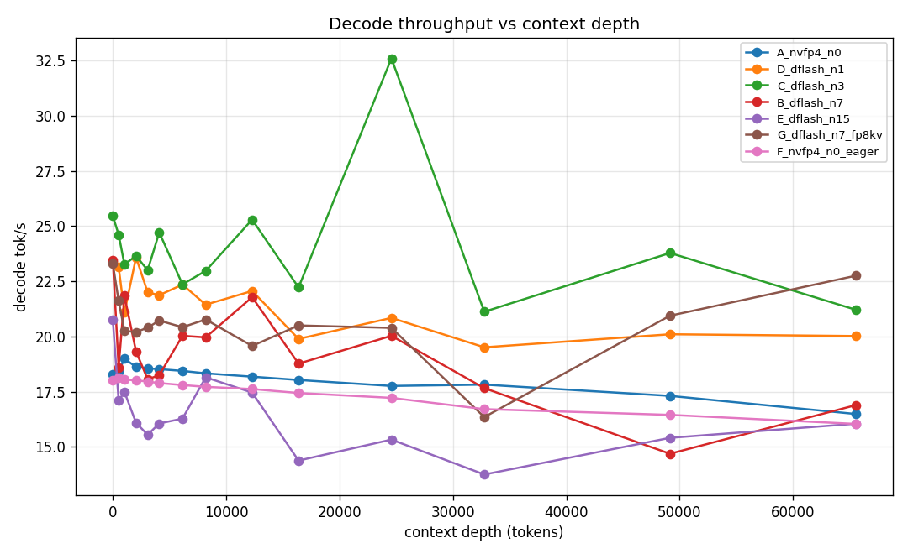
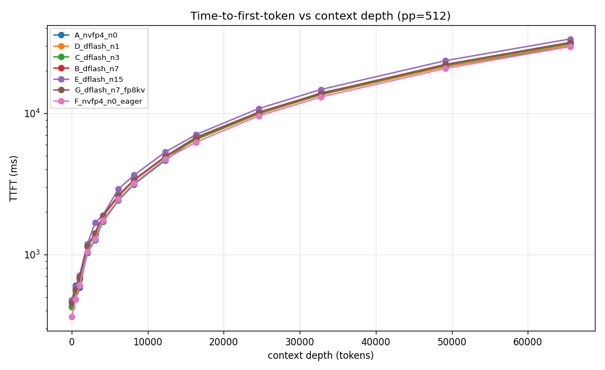
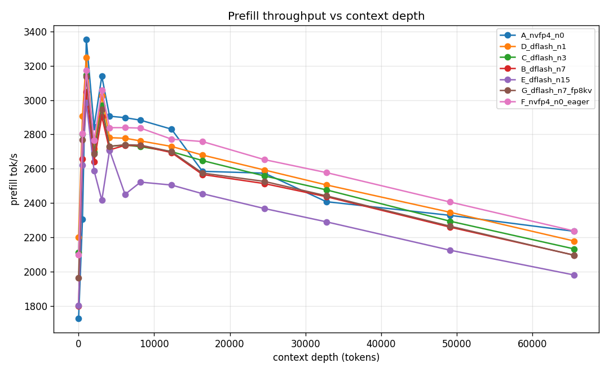
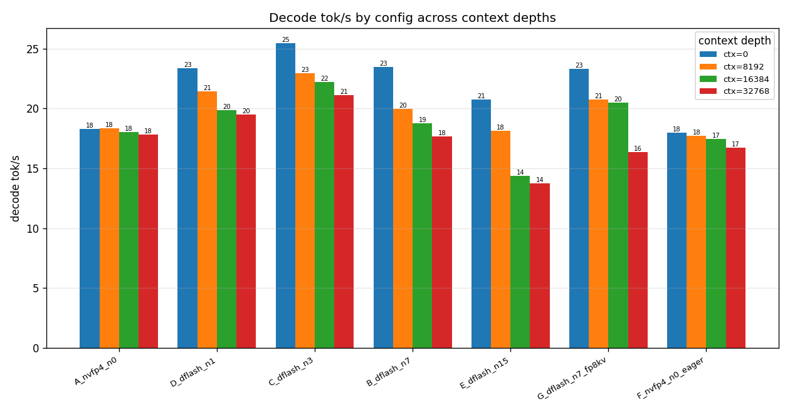
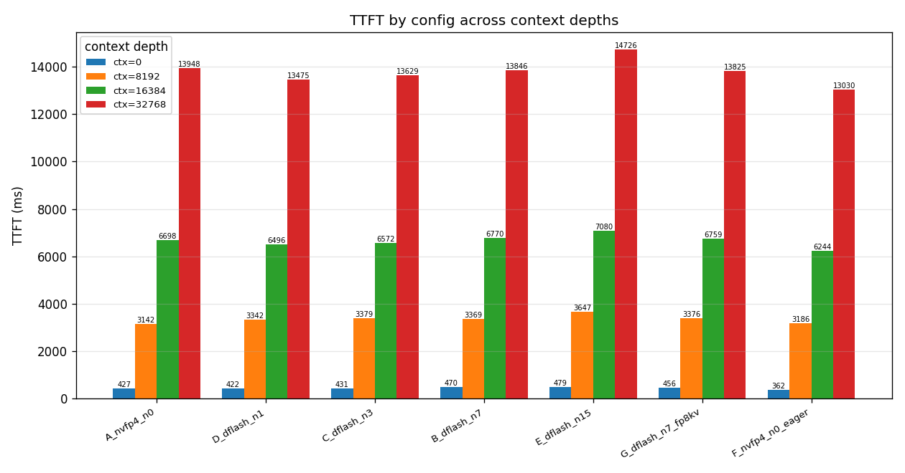

# GLM-4.7 355B AWQ on 2× DGX Spark (GB10) — performance sweep

Standard benchmark: **llama-benchy** (llama-bench-style). Model kept constant (QuantTrio/GLM-4.7-AWQ W4A16, TP=2 over 200G fabric). Each config redeployed fresh; context-depth sweep with pp=512, tg=256, runs=2, latency-mode=generation.

_llama-benchy 0.4.0 · single-stream (concurrency=1)_

## Configs

| config | KV dtype | speculation | extra | max_model_len |
|---|---|---|---|---|
| `A_nvfp4_n0` | auto | none (n=0) | - | 262144 |
| `D_dflash_n1` | auto | DFlash n=1 | - | 262144 |
| `C_dflash_n3` | auto | DFlash n=3 | - | 262144 |
| `B_dflash_n7` | auto | DFlash n=7 | - | 262144 |
| `E_dflash_n15` | auto | DFlash n=15 | - | 262144 |
| `G_dflash_n7_fp8kv` | fp8 | DFlash n=7 | - | 262144 |
| `F_nvfp4_n0_eager` | auto | none (n=0) | enforce-eager | 262144 |

## Summary — decode tok/s and TTFT by context

| config | dec@0 | dec@4k | dec@16k | dec@32k | ttft@16k(ms) | ttft@32k(ms) |
|---|--:|--:|--:|--:|--:|--:|
| `A_nvfp4_n0` | 18.3 | 18.5 | 18.0 | 17.8 | 6698.0 | 13947.8 |
| `D_dflash_n1` | 23.4 | 21.9 | 19.9 | 19.5 | 6496.5 | 13474.6 |
| `C_dflash_n3` | 25.4 | 24.7 | 22.2 | 21.1 | 6572.2 | 13629.4 |
| `B_dflash_n7` | 23.5 | 18.2 | 18.8 | 17.7 | 6769.9 | 13845.9 |
| `E_dflash_n15` | 20.8 | 16.1 | 14.4 | 13.8 | 7079.6 | 14726.1 |
| `G_dflash_n7_fp8kv` | 23.3 | 20.7 | 20.5 | 16.4 | 6758.7 | 13824.9 |
| `F_nvfp4_n0_eager` | 18.0 | 17.9 | 17.4 | 16.7 | 6243.6 | 13030.4 |

## Full data

See `dataset.csv` / `dataset.json`. Per-config, per-context rows:

| config | ctx | prefill t/s | decode t/s | peak t/s | TTFT ms |
|---|--:|--:|--:|--:|--:|
| `A_nvfp4_n0` | 0 | 1726.18 | 18.27 | 20.0 | 426.8 |
| `A_nvfp4_n0` | 512 | 2304.45 | 18.41 | 20.0 | 606.6 |
| `A_nvfp4_n0` | 1024 | 3354.62 | 18.99 | 20.0 | 580.7 |
| `A_nvfp4_n0` | 2048 | 2843.2 | 18.62 | 20.0 | 1023.2 |
| `A_nvfp4_n0` | 3072 | 3139.11 | 18.56 | 19.0 | 1264.6 |
| `A_nvfp4_n0` | 4096 | 2905.86 | 18.52 | 19.0 | 1708.3 |
| `A_nvfp4_n0` | 6144 | 2897.48 | 18.44 | 19.0 | 2419.9 |
| `A_nvfp4_n0` | 8192 | 2882.68 | 18.33 | 19.0 | 3142.3 |
| `A_nvfp4_n0` | 12288 | 2830.4 | 18.18 | 19.0 | 4645.3 |
| `A_nvfp4_n0` | 16384 | 2584.7 | 18.03 | 19.0 | 6698.0 |
| `A_nvfp4_n0` | 24576 | 2573.93 | 17.76 | 19.0 | 9892.5 |
| `A_nvfp4_n0` | 32768 | 2407.79 | 17.82 | 19.0 | 13947.8 |
| `A_nvfp4_n0` | 49152 | 2327.92 | 17.31 | 19.0 | 21458.9 |
| `A_nvfp4_n0` | 65536 | 2235.24 | 16.49 | 18.0 | 29681.4 |
| `D_dflash_n1` | 0 | 2200.16 | 23.38 | 27.5 | 422.5 |
| `D_dflash_n1` | 512 | 2905.09 | 23.14 | 27.5 | 543.1 |
| `D_dflash_n1` | 1024 | 3248.42 | 21.08 | 25.5 | 663.3 |
| `D_dflash_n1` | 2048 | 2714.68 | 23.58 | 28.5 | 1133.7 |
| `D_dflash_n1` | 3072 | 3023.99 | 22.0 | 26.5 | 1375.7 |
| `D_dflash_n1` | 4096 | 2780.79 | 21.87 | 29.0 | 1847.3 |
| `D_dflash_n1` | 6144 | 2777.57 | 22.35 | 27.0 | 2586.8 |
| `D_dflash_n1` | 8192 | 2761.86 | 21.44 | 26.0 | 3341.9 |
| `D_dflash_n1` | 12288 | 2729.73 | 22.06 | 27.5 | 4879.7 |
| `D_dflash_n1` | 16384 | 2679.42 | 19.89 | 26.0 | 6496.5 |
| `D_dflash_n1` | 24576 | 2592.43 | 20.84 | 26.5 | 9868.1 |
| `D_dflash_n1` | 32768 | 2505.49 | 19.51 | 23.0 | 13474.6 |
| `D_dflash_n1` | 49152 | 2345.85 | 20.1 | 26.0 | 21365.1 |
| `D_dflash_n1` | 65536 | 2178.57 | 20.02 | 25.0 | 30513.0 |
| `C_dflash_n3` | 0 | 2111.53 | 25.45 | 34.0 | 431.0 |
| `C_dflash_n3` | 512 | 2802.31 | 24.61 | 34.0 | 554.2 |
| `C_dflash_n3` | 1024 | 3146.07 | 23.26 | 33.5 | 677.1 |
| `C_dflash_n3` | 2048 | 2694.77 | 23.65 | 33.5 | 1138.8 |
| `C_dflash_n3` | 3072 | 2968.47 | 23.0 | 31.5 | 1396.2 |
| `C_dflash_n3` | 4096 | 2730.39 | 24.71 | 34.5 | 1876.6 |
| `C_dflash_n3` | 6144 | 2737.66 | 22.36 | 36.5 | 2620.2 |
| `C_dflash_n3` | 8192 | 2728.06 | 22.97 | 35.0 | 3379.4 |
| `C_dflash_n3` | 12288 | 2699.3 | 25.29 | 40.0 | 4931.0 |
| `C_dflash_n3` | 16384 | 2647.32 | 22.22 | 30.0 | 6572.2 |
| `C_dflash_n3` | 24576 | 2557.81 | 32.59 | 39.5 | 9999.6 |
| `C_dflash_n3` | 32768 | 2476.63 | 21.12 | 29.0 | 13629.4 |
| `C_dflash_n3` | 49152 | 2293.77 | 23.78 | 32.0 | 21844.9 |
| `C_dflash_n3` | 65536 | 2132.54 | 21.21 | 30.0 | 31160.8 |
| `B_dflash_n7` | 0 | 1799.97 | 23.47 | 37.5 | 469.9 |
| `B_dflash_n7` | 512 | 2657.13 | 18.6 | 26.0 | 571.1 |
| `B_dflash_n7` | 1024 | 3046.28 | 21.84 | 30.0 | 690.0 |
| `B_dflash_n7` | 2048 | 2641.01 | 19.32 | 30.5 | 1155.1 |
| `B_dflash_n7` | 3072 | 2904.8 | 18.06 | 31.0 | 1419.7 |
| `B_dflash_n7` | 4096 | 2709.67 | 18.25 | 25.0 | 1886.5 |
| `B_dflash_n7` | 6144 | 2736.07 | 20.03 | 28.0 | 2618.6 |
| `B_dflash_n7` | 8192 | 2734.29 | 19.96 | 28.0 | 3369.2 |
| `B_dflash_n7` | 12288 | 2694.01 | 21.78 | 46.0 | 4936.8 |
| `B_dflash_n7` | 16384 | 2566.12 | 18.77 | 28.0 | 6769.9 |
| `B_dflash_n7` | 24576 | 2513.16 | 20.03 | 34.0 | 10170.5 |
| `B_dflash_n7` | 32768 | 2436.84 | 17.66 | 23.0 | 13845.9 |
| `B_dflash_n7` | 49152 | 2259.08 | 14.69 | 21.5 | 22173.3 |
| `B_dflash_n7` | 65536 | 2096.14 | 16.89 | 27.5 | 31697.2 |
| `E_dflash_n15` | 0 | 1803.07 | 20.75 | 32.0 | 478.9 |
| `E_dflash_n15` | 512 | 2621.33 | 17.1 | 27.0 | 586.5 |
| `E_dflash_n15` | 1024 | 2985.0 | 17.49 | 28.5 | 710.1 |
| `E_dflash_n15` | 2048 | 2588.56 | 16.09 | 25.5 | 1184.8 |
| `E_dflash_n15` | 3072 | 2416.18 | 15.55 | 26.0 | 1679.2 |
| `E_dflash_n15` | 4096 | 2707.58 | 16.06 | 26.0 | 1897.5 |
| `E_dflash_n15` | 6144 | 2450.26 | 16.28 | 32.0 | 2911.7 |
| `E_dflash_n15` | 8192 | 2521.71 | 18.15 | 29.5 | 3647.3 |
| `E_dflash_n15` | 12288 | 2504.79 | 17.46 | 27.0 | 5305.8 |
| `E_dflash_n15` | 16384 | 2454.33 | 14.38 | 23.5 | 7079.6 |
| `E_dflash_n15` | 24576 | 2367.85 | 15.33 | 22.0 | 10790.8 |
| `E_dflash_n15` | 32768 | 2290.34 | 13.75 | 20.5 | 14726.1 |
| `E_dflash_n15` | 49152 | 2124.76 | 15.41 | 25.5 | 23571.5 |
| `E_dflash_n15` | 65536 | 1980.56 | 16.05 | 24.0 | 33544.4 |
| `G_dflash_n7_fp8kv` | 0 | 1962.07 | 23.29 | 37.0 | 456.3 |
| `G_dflash_n7_fp8kv` | 512 | 2768.97 | 21.61 | 42.5 | 565.4 |
| `G_dflash_n7_fp8kv` | 1024 | 3137.68 | 20.25 | 29.0 | 685.3 |
| `G_dflash_n7_fp8kv` | 2048 | 2686.81 | 20.2 | 30.5 | 1148.6 |
| `G_dflash_n7_fp8kv` | 3072 | 2944.53 | 20.4 | 35.5 | 1413.0 |
| `G_dflash_n7_fp8kv` | 4096 | 2730.3 | 20.72 | 35.0 | 1883.7 |
| `G_dflash_n7_fp8kv` | 6144 | 2739.77 | 20.42 | 43.5 | 2624.8 |
| `G_dflash_n7_fp8kv` | 8192 | 2737.05 | 20.77 | 30.0 | 3375.8 |
| `G_dflash_n7_fp8kv` | 12288 | 2699.35 | 19.57 | 27.5 | 4937.3 |
| `G_dflash_n7_fp8kv` | 16384 | 2574.46 | 20.5 | 40.5 | 6758.7 |
| `G_dflash_n7_fp8kv` | 24576 | 2525.78 | 20.39 | 32.0 | 10128.6 |
| `G_dflash_n7_fp8kv` | 32768 | 2442.02 | 16.35 | 23.0 | 13824.9 |
| `G_dflash_n7_fp8kv` | 49152 | 2264.75 | 20.94 | 32.5 | 22128.7 |
| `G_dflash_n7_fp8kv` | 65536 | 2095.64 | 22.75 | 50.0 | 31713.1 |
| `F_nvfp4_n0_eager` | 0 | 2097.75 | 18.0 | 19.0 | 361.7 |
| `F_nvfp4_n0_eager` | 512 | 2803.64 | 18.12 | 19.0 | 483.2 |
| `F_nvfp4_n0_eager` | 1024 | 3171.77 | 18.05 | 19.0 | 602.3 |
| `F_nvfp4_n0_eager` | 2048 | 2764.55 | 18.01 | 19.0 | 1044.1 |
| `F_nvfp4_n0_eager` | 3072 | 3057.45 | 17.96 | 19.0 | 1290.1 |
| `F_nvfp4_n0_eager` | 4096 | 2839.07 | 17.89 | 19.0 | 1741.1 |
| `F_nvfp4_n0_eager` | 6144 | 2839.22 | 17.8 | 19.0 | 2462.6 |
| `F_nvfp4_n0_eager` | 8192 | 2836.62 | 17.72 | 19.0 | 3186.5 |
| `F_nvfp4_n0_eager` | 12288 | 2772.31 | 17.62 | 18.0 | 4735.7 |
| `F_nvfp4_n0_eager` | 16384 | 2758.21 | 17.44 | 18.0 | 6243.6 |
| `F_nvfp4_n0_eager` | 24576 | 2652.79 | 17.22 | 18.0 | 9575.2 |
| `F_nvfp4_n0_eager` | 32768 | 2577.39 | 16.71 | 18.0 | 13030.4 |
| `F_nvfp4_n0_eager` | 49152 | 2405.49 | 16.45 | 17.0 | 20766.5 |
| `F_nvfp4_n0_eager` | 65536 | 2237.19 | 16.04 | 17.0 | 29641.3 |

## Graphs

